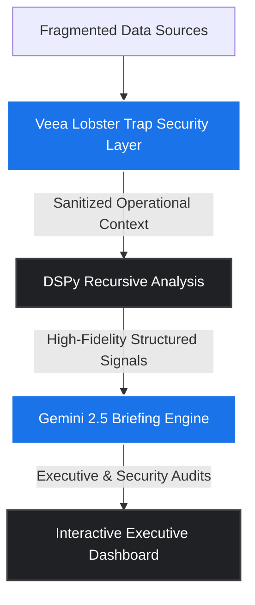
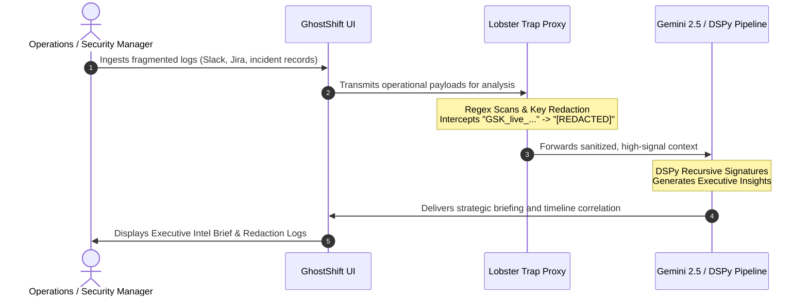
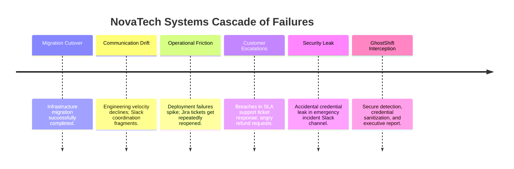
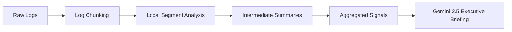
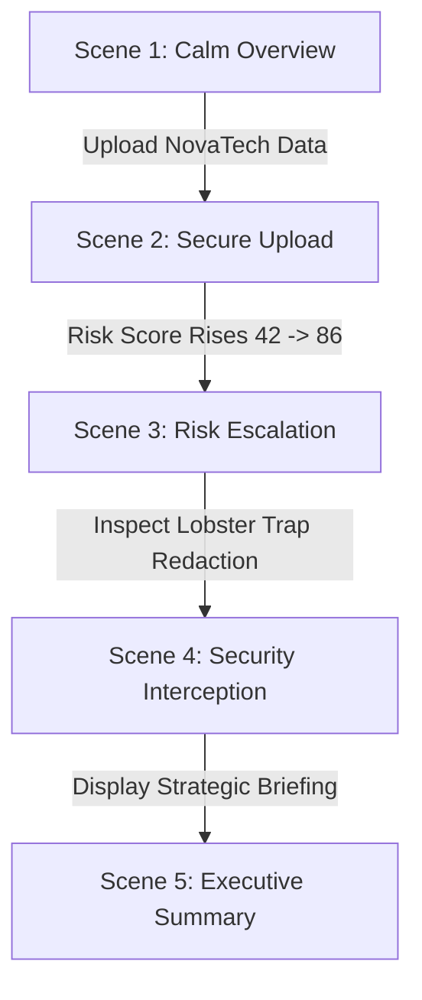

# Product Requirements Document (PRD)
## GhostShift Secure — Enterprise Early-Warning Intelligence

> **GhostShift Secure** continuously analyzes fragmented enterprise operational data to detect hidden organizational risks, operational drift, and security threats before they escalate into business failures.

---

## 1. Executive Summary

GhostShift Secure is an AI-powered enterprise intelligence system designed for the **TechEx Intelligent Enterprise Solutions Hackathon**. 

The system ingests fragmented operational data sources, extracts emerging signals, and maps them to executive-grade warnings while proactively enforcing secure AI processing boundaries.

### 🔌 Core Sponsor Technologies & Roles


*   **Veea Lobster Trap (Track 1: Agent Security & AI Governance)**: Intercepts outgoing LLM payloads, redacts sensitive operational information (e.g. API keys, PII), blocks prompt injection, and generates security audit logs.
*   **Gemini 2.5 & Google AI Studio (Track 4: Data & Intelligence)**: Translates high-fidelity consolidated signals into tactical executive briefings, root cause explanations, and 72-hour mitigation schedules.
*   **DSPy Recursive Pipeline**: Orchestrates structured recursive analysis to safely process large timelines and logs without exceeding context limits or losing signal fidelity.

> [!IMPORTANT]
> **Core Differentiator**: GhostShift Secure does not simply retrieve documents (standard RAG). It connects seemingly unrelated events—a customer escalation, an incident ticket, and a frantic Slack conversation—to reveal the overarching organizational drift.

---

## 2. Hackathon Strategy & Objectives

### 🎯 Key Goals
*   **Emotional Demo Impact**: Build a narrative arc that moves from *calm operation* to *hidden drift* to *security interception* and finally *executive clarity*.
*   **Perceived Enterprise Value**: Demonstrate clear ROI by highlighting how predicting a delivery slip or incident prevent cost escalation.
*   **Sponsor Alignment**: Emphasize **Veea Lobster Trap** and **Gemini 2.5** as integral architectural pillars.
*   **Production Credibility**: Utilize solid design patterns (FastAPI, DSPy orchestration, and robust UI styling).

### 🛑 Non-Goals (Out of Scope)
*   Creating a generalized chatbot or agent playground.
*   Building a multi-agent autonomous swarm.
*   Designing production-ready database migrations (SQLite/mock storage is sufficient).
*   Chasing architectural purity at the cost of demo stability.

---

## 3. Core User Story



1.  **Ingestion**: An operations manager uploads multi-format files (Slack logs, Jira tickets, incident reports, CSVs, PDFs).
2.  **Detection**: The system detects project delivery slips, communication fragmentation, incident clustering, and customer dissatisfaction trends.
3.  **Security Filtering**: Sensitive API keys and internal credentials are intercepted and redacted *before* reaching external LLMs.
4.  **Executive Brief**: The system explains the root cause of the operational drift, shows the change over time, and lists evidence-linked findings with 72-hour remediation steps.

---

## 4. Primary Demo Narrative (The NovaTech Scenario)

Fictional enterprise **NovaTech Systems** recently completed a core infrastructure migration. Below is the chronological sequence of hidden drift that GhostShift Secure exposes:



---

## 5. Feature Specifications

### 5.1 Operational Risk Detection
*   **Aggregated Scoring**: Tracks risk transition from a calm **42** to a critical **86** as the incident details are evaluated.
*   **Multi-Vector Anomaly Mapping**: Maps signals across communication channels, developer ticketing, and incident reporting.
*   **Standard Risk Schema Output**:
    *   **Severity Score**: Impact scale (High / Medium / Low).
    *   **Confidence Score**: Percentage of confidence in correlation.
    *   **Executive Explanation**: A clear, concise sentence summarizing the risk.
    *   **Timeline Correlation**: Linking events back to original logs.

### 5.2 Executive Intelligence Summaries
Powered by Gemini 2.5 to provide structured strategic outputs:
*   **Root Cause Analysis**: Explains *why* the drift is happening (e.g. "Platform team became a single-point-of-failure after the migration rollback").
*   **Primary Decision Framing**: Distills complex incident groups into one clear executive choice.
*   **72-Hour Action Plan**: Actionable remediation steps with clear ownership.
*   **Historical Change Tracker**: Details what changed over the last 1-4 periods.

### 5.3 Security & Governance Layer
Implements the proxy rules of **Veea Lobster Trap**:
*   **Secret Detection**: Matches high-risk string patterns (e.g., `GSK_live_[a-zA-Z0-9]{26}`).
*   **Payload Sanitization**: Replaces sensitive strings with `[REDACTED_API_KEY]` before calling LLMs.
*   **Governance Audit Trail**: Visualizes original payload vs. sanitized model context side-by-side.

### 5.4 Recursive Intelligence Analysis (DSPy Orchestration)
Maintains high signal fidelity across large operational logs:


### 5.5 Timeline Intelligence & Security Dashboards
*   **Interactive Timeline**: Displays chronologically linked events so users can visually correlate the infrastructure migration to customer support spikes.
*   **Security Event Log**: Dedicated dashboard showing blocked requests, sanitization logs, and outbound telemetry filters.

---

## 6. User Personas

| Persona | Core Need | Key Feature | Value Proposition |
| :--- | :--- | :--- | :--- |
| **Executive Leadership (CEO/COO)** | Strategic overview, financial/operational health, concise briefings. | **Executive Intel Brief** | Avoids operational blindspots and translates technical noise into boardroom decisions. |
| **Security & Compliance (CISO)** | Data leakage prevention, AI governance compliance, auditing. | **Lobster Trap Security Governance** | Safely enables generative AI across enterprise operations without leaking intellectual property. |
| **Operations Managers (VPs/Directors)** | Cross-team alignment, delivery risk prevention, incident correlation. | **Operational Risk Timeline** | Breaks down team silos to catch downstream delays before they slip target deadlines. |

---

## 7. UX & Design Requirements

*   **Design Aesthetics**: A premium, high-contrast, professional styling resembling enterprise monitoring systems (Linear, Datadog, Palantir).
*   **Typography**: Google Font (e.g., Inter, Outfit) for optimal reading comfort.
*   **Visual Structure**: High information density but clean and structured. Uses subtle micro-animations for card hovers, status changes, and drawer openings.
*   **Color Palette**: Sleek dark base with curated primary cues (indigo, amber, rose, and emerald for operational state tags).

---

## 8. Core Screens & Views

1.  **Landing Dashboard**: Shows the global organization risk score, risk dials, primary alerts list, and recent anomaly timeline.
2.  **Secure Upload Center**: Visual cards for Slack exports, Jira tickets, and incident reports. Shows real-time Lobster Trap filtering status.
3.  **Executive Intelligence Suite**: Boardroom-ready view displaying root causes, key metrics, and 72-hour actions.
4.  **Security Governance Hub**: Deep-dive comparison tool visualizing how data is intercepted, redacted, and validated prior to external LLM calls.
5.  **Evidence Drawer**: Fly-out sliding panel that opens when clicking a risk signal, providing full documentation, snippets, confidence metrics, and context files.

---

## 9. Technical Architecture & Tech Stack

*   **Frontend**: Static HTML5 structure, responsive Vanilla CSS system, premium layouts, and Javascript-based reactive state-management.
*   **Backend**: Dependency-free, standalone Python API server (`demo_server.py`) serving endpoints on port `8765`, with an alternative FastAPI scaffold (`main.py`).
*   **AI Orchestration**: DSPy recursive pipelines utilizing prompt signatures.
*   **Security Layer**: Standalone regex-based security sanitization scanner (`security.py`).
*   **Fictional Data Store**: Static JSON/JSONL datasets representing historical NovaTech migrations (`data/novatech/*`).

---

## 10. DSPy Architecture Detail

### 📋 Signature Definitions

```python
class RiskSignal(Signature):
    """Analyzes recent operational communications to extract structural risk signals."""
    communication_log = InputField(desc="Combined Slack channels and ticket transcripts")
    operational_risk = OutputField(desc="Structured description of identified drift")
    confidence = OutputField(desc="Confidence score (0.0 to 1.0) of the signal correlation")

class IncidentSummary(Signature):
    """Consolidates technical incident logs into strategic briefs for executives."""
    incident_logs = InputField(desc="Markdown files and post-mortems of system failures")
    root_cause = OutputField(desc="Underlying root-cause explanation")
    business_impact = OutputField(desc="Downstream effects on customers and operations")
```

### 🧠 Modules Configured
*   `communication_drift_detector`
*   `escalation_detector`
*   `deployment_risk_analyzer`
*   `customer_sentiment_analyzer`
*   `security_anomaly_detector`
*   `operational_summarizer`

---

## 11. Ingested Dataset: NovaTech Systems

The dataset consists of four mock operational resources, crafted to simulate a real post-migration scenario:

*   **Slack Logs (`slack_logs.jsonl`)**: Shows engineer frustrations, communication breakdowns between core platform and product teams, code warnings, and an accidental credential leak of `GSK_live_91f4b8ab73a2f23de0c871e921`.
*   **Jira Tickets (`jira_tickets.csv`)**: Details critical dependencies blocking key deployments, ticket reopen loops, and SLA slippages.
*   **Customer Support Logs (`support_tickets.csv`)**: Displays rising customer refund threats, angry complaints about performance degradation, and SLA ticket responses.
*   **Incident Reports (`incident_reports.md`)**: Contains root-cause writeups for rollback failures and system downtime.

---

## 12. The Five-Scene Pitch Flow



1.  **Scene 1 (Calm Overview)**: The system shows a baseline operational risk of **42**. Everything seems stable.
2.  **Scene 2 (Secure Upload)**: NovaTech files are uploaded. The ingestion scanner runs to extract core data.
3.  **Scene 3 (Risk Escalation)**: The risk score rises rapidly to **86**. Critical warnings light up, mapping communications to outages.
4.  **Scene 4 (Security Interception)**: Demonstrates Veea Lobster Trap blocking a leaked API key inside Slack logs, preventing outbound LLM contamination.
5.  **Scene 5 (Executive Summary)**: Presents the strategic brief, root cause, and 72-hour remediation plan, concluding the pitch.

---

## 13. Build & Review Strategy

### 💻 Automated Agent Scaffolding
*   **Frontend**: Render standard component frameworks, interactive tables, custom charts, and full viewport CSS adjustments.
*   **Backend**: Setup routes, mock endpoints, custom JSON serialization, and response verification.
*   **DSPy/Scanners**: Implement regular expressions, validation checks, and placeholder pipeline routes.

### 👓 Core Human Guidelines
*   **Narrative Resonance**: Ensure that the data, outputs, and briefings feel authentic and carry emotional weight.
*   **Strategic Wording**: Ensure all Gemini-generated text is precise and professional.
*   **Visual Taste**: Deliver slick typography, appropriate margins, seamless transitions, and flawless drawer behavior.

---

## 14. Success Criteria

1.  **Emotional Resonance**: The escalation curve creates a memorable narrative arc.
2.  **Product Depth**: Judges perceive the system as a real, deployable enterprise intelligence tool rather than a generic chat window.
3.  **Technical Credibility**: The architecture shows realistic, decoupled security scanning and recursive pipeline stages.
4.  **Seamless Execution**: Zero console warnings, responsive screen adapters, and instant mock API server fallbacks.
